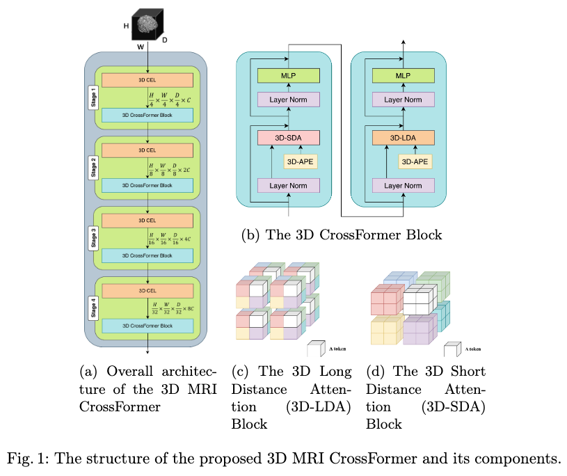
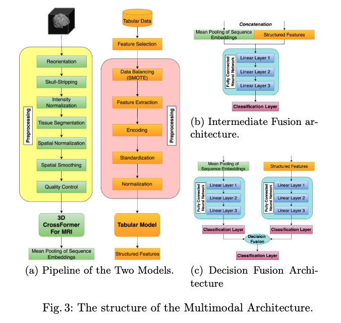
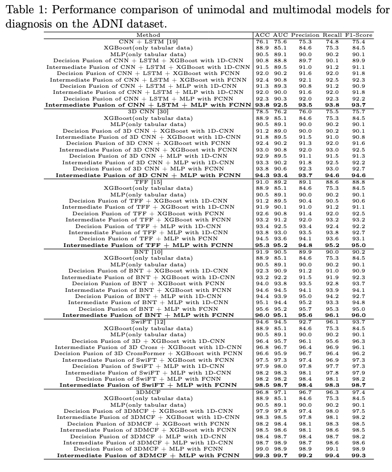
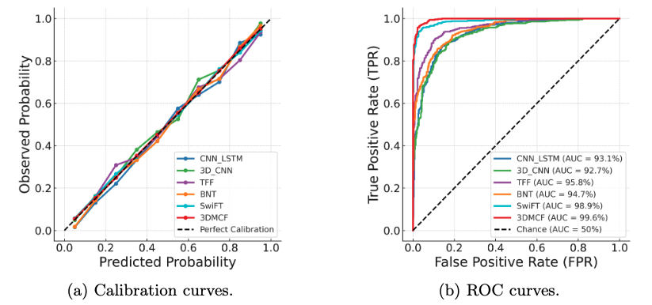

# Robust Multi-Scale 3D CrossFormer for Alzheimer’s Diagnosis

This repository contains the implementation and experimental code for the paper:

**Robust Multi-Scale 3D CrossFormer Model for Multimodal Medical Image Analysis using Volumetric MRI and Structured Data**

---

## Overview

Deep learning approaches have revolutionized medical image analysis. Our work introduces a novel 3D Vision Transformer (3DMCF) tailored to volumetric MRI and a multimodal fusion strategy that integrates 3D MRI embeddings with structured clinical data for Alzheimer’s disease (AD) diagnosis.

## Key Features

- **3D CrossFormer Architecture**: Hierarchical cross-scale embeddings and dual-range self-attention (3D-LDA & 3D-SDA) for rich spatial feature extraction.
- **Multimodal Fusion**: Intermediate fusion of MRI and tabular embeddings via a fully-connected fusion head.
- **State-of-the-Art Performance**: Achieves 99.3% accuracy and 99.7% AUC on the ADNI dataset.
- **Explainable AI**: Guided Grad-CAM highlights key brain regions (hippocampus, entorhinal cortex, medial temporal lobe).

## Figures

The following figures from the paper illustrate key components and results:

- **Fig. 1 (Paper Fig.1): Overall Architecture of the 3D MRI CrossFormer**  
    
  This figure presents the end-to-end design of the 3D MRI CrossFormer with four progressive stages. Each stage uses a 3D Cross-Scale Embedding Layer (3D-CEL) followed by dual-range self-attention modules (3D-LDA for long-range and 3D-SDA for short-range) to capture both global and local volumetric features.

- **Fig. 2 (Paper Fig.3a): Pipeline of the Multimodal Models**  
    
  This diagram compares the preprocessing and feature extraction pipelines for the MRI branch and the tabular data branch. The MRI branch includes steps such as reorientation, skull stripping, intensity normalization, tissue segmentation, spatial registration, and smoothing, while the tabular branch applies class balancing (SMOTE), feature extraction, encoding, standardization, and normalization.

- **Fig. 3 (Paper Table 1): Performance Comparison Table**  
    
  This table summarizes accuracy (ACC), AUC, precision, recall, and F1-score for unimodal and multimodal models on the ADNI dataset. The intermediate fusion of the 3DMCF embeddings with structured data through a fully-connected fusion network achieves the highest performance (99.3% ACC, 99.7% AUC).

- **Fig. 4 (Paper Fig.4): Calibration and ROC Curves**  
    
  The left panel shows calibration curves comparing predicted probabilities with observed outcomes, indicating near-perfect calibration for the 3DMCF model. The right panel displays ROC curves for each model, with the 3DMCF model achieving an AUC of 99.6%.

## Datasets

- **ADNI 3D MRI**: Baseline T1-weighted volumetric MRI scans from the Alzheimer’s Disease Neuroimaging Initiative (ADNI). Download via [ADNI](http://adni.loni.usc.edu/).
- **Clinical Tabular Data**: Structured features including age, sex, education, APOE4 count, MMSE, CDR-SB, and ADAS13, provided in `models/tabular/ADNIMERGE_12Dec2024.csv`.

## Repository Structure
```
MML-AlzheimerDiagnosis/
├── configs/
│   ├── 3DMCF/
│   └── 3DMCF_pp/
├── data/
│   └── tabular/
│       └── ADNIMERGE_12Dec2024.csv
├── models/
│   ├── utils/
│   │   ├── data_preprocess_and_load/
│   │   ├── __init__.py
│   │   ├── data_module.py
│   │   ├── losses.py
│   │   ├── lr_scheduler.py
│   │   ├── metrics.py
│   │   ├── neptune_utils.py
│   │   ├── parser.py
│   │   └── seed_creation.py
│   ├── 3DMCF.py
│   ├── __init__.py
│   ├── build.py
│   └── Crossformer.py
├── readme_files/
├── LICENSE
└── README.md
```


## Usage

1. **MRI Preprocessing**:
```bash
python build.py --mode preprocess --config configs/3DMCF_pp/base.yaml
```
2. **Training**
```bash
python 3DMCF.py --config configs/3DMCF/base.yaml
```
## Installation
```bash
# Clone the repository
git clone https://github.com/your_username/MML-AlzheimerDiagnosis.git
cd MML-AlzheimerDiagnosis

# Create and activate conda environment
conda env create -f configs/3DMCF/environment.yaml
conda activate mri_env

# Install Python requirements
pip install -r requirements.txt
```
